# **AI-KYC — Intelligent Video-Based KYC Automation**
**Built for GHCI Hackathon 2025**

Reimagining digital onboarding with AI-powered document verification, biometric identity matching, and real-time video authentication — ensuring compliance, transparency, and scalability.

---

## ⚡ Overview

AI-KYC is a next-generation video-based KYC system powered by:

- **Machine Learning**
- **WebRTC-based live identity capture**
- **OCR-powered document parsing**
- **Biometric face recognition + liveness detection**
- **Automated risk scoring with explainable audit logs**

---

## ⚠️ Problem

Traditional KYC systems are:

- Slow and manual  
- Error-prone  
- Expensive at scale  
- Hard for elderly / non-technical users

There’s a need for a smart, automated, accessible, multilingual verification system that reduces friction while preventing fraud.

---

## 🎯 Our Solution

**AI-KYC automates the entire verification lifecycle:**

- Conversational guided onboarding  
- OCR-based document scanning  
- Face matching + passive liveness detection  
- Read-aloud text verification (multilingual)  
- Human review escalation when confidence drops

**Outcome:** Days → Minutes

---

## 🛠 Feature Matrix

| Feature                                 | Status       |
|----------------------------------------:|:------------:|
| AI-guided conversational onboarding     | ✅            |
| WebRTC Live Capture                     | ✅            |
| PAN / Aadhaar OCR Parsing               | ✅            |
| Signature Detection                     | 🧪 Prototype  |
| Passive Liveness Detection              | ✅            |
| Facial Recognition                      | ✅            |

---

## 🧩 Improved Architecture & Runbook

```mermaid
flowchart LR

%% --- STEP 1: CLIENT ---
A["🧑‍💻 WebRTC Client\n- Video Capture\n- Inline Validation\n- Consent & Session"]

-->|"WebRTC + JWT Auth"| B

%% --- STEP 2: API GATEWAY ---
B["🔐 API Gateway / Auth Layer\n- OAuth2/JWT\n- Rate Limiting\n- REST + WebSocket Routing"]

-->|"SDP / ICE Signaling"| C
B -->|"KYC Submission (REST/gRPC)"| D

%% --- STEP 3: SIGNALING / MEDIA ---
C["📡 Signaling Service\n- Session Negotiation"] --> TURN

TURN["TURN/STUN Media Relay"]

%% --- STEP 4: INGEST & QUEUE ---
D["📩 Ingestion Service\n- Create KYC Session\n- Store Metadata\n- Trigger Processing"] -->|"Publish Event"| E

%% --- STEP 5: EVENT STREAM ---
E["📬 Message Broker (Kafka / RabbitMQ / Redis Streams)"] -->|"ML Jobs"| F

%% --- STEP 6: ML PROCESSING CLUSTER ---
F["🤖 ML Inference Cluster\n- OCR (Documents)\n- Face Match\n- Liveness & Anti-Spoofing"] -->|"Signals + Confidence Scores"| G

%% --- STEP 7: RISK ENGINE ---
G["⚖️ Risk Engine\n- Signal Aggregation\n- Scoring Model\n- Rules / Compliance Logic"] -->|"Decision Payload"| H

%% --- STEP 8: DECISION SYSTEM ---
H["🧠 Decision System 🟢 Approve | 🔴 Reject | 🟡 Review"] -->|"Escalated Cases"| I
H -->|"Approved / Rejected"| J

%% --- STEP 9: HUMAN REVIEW UI ---
I["🧑‍🏫 Manual Review Dashboard\n- Evidence Viewer\n- Reviewer Actions"] -->|"Override Decision"| J

%% --- FINAL STORAGE ---
J["🗂 Persistent Storage\n- MongoDB (KYC State)\n- S3/MinIO (Media)\n- Feature Store (ML Signals)"] --> K

%% --- STEP 11: AUDIT & MONITORING ---
K["📊 Compliance, Telemetry & Audit\n- OpenTelemetry\n- Prometheus/Grafana\n- Immutable Logs"]
```

Textual numbered steps (matching the flowchart above):

1. Client — WebRTC capture and session init
   - Purpose: Collect live video, document images, and user consent from the user's device.
   - Responsibilities: Camera/microphone access, inline validation (document framing, blur checks), capture quality feedback, display terms/consent, create a short-lived client JWT.
   - Inputs: User device media, user-provided documents, user metadata.
   - Outputs: SDP offer (for signaling), initial KYC submission request (REST) or session creation call.
   - Protocols: WebRTC media, HTTPS for REST/gRPC, OAuth/JWT for auth.
   - Notes: Provide client-side guidance and retry logic for capture failures.

2. API Gateway / Auth Layer
   - Purpose: Central entrypoint for authentication, routing, rate limiting and request validation.
   - Responsibilities: Validate JWT/OAuth tokens, apply rate limits and WAF rules, route signaling and API calls to appropriate services.
   - Inputs: SDP offers, KYC submission payloads, client metadata.
   - Outputs: Auth-validated requests forwarded to signaling or ingestion, access tokens for downstream services.
   - Protocols: HTTPS, WebSocket upgrade for signaling where applicable.
   - Notes: Log request traces and enforce multi-tenant quotas.

3. Signaling Service (SDP / ICE)
   - Purpose: Negotiate WebRTC connections and coordinate ICE candidates.
   - Responsibilities: Exchange SDP offers/answers, coordinate STUN/TURN usage, manage ephemeral session state.
   - Inputs: SDP/ICE from client and relay configuration.
   - Outputs: WebRTC session established or errors (e.g., connectivity issues).
   - Notes: Use TURN for restrictive networks; emit connection metrics and errors to monitoring.

4. TURN/STUN Media Relay
   - Purpose: Relay media when direct peer connectivity fails.
   - Responsibilities: Reliable media forwarding, bandwidth and connection health metrics.
   - Notes: Secure with TLS and authenticated TURN credentials; autoscale relay pool.

5. Ingestion Service — create KYC session & enqueue work
   - Purpose: Create a canonical KYC session, persist initial metadata and queue downstream processing.
   - Responsibilities: Persist session record (session_id), store minimal metadata, store references to media, publish processing event to message broker.
   - Inputs: KYC payload from client, media references or upload URLs.
   - Outputs: session_id, event published to broker, HTTP response to client confirming session creation.
   - Notes: Validate payload schema, return deterministic IDs for traceability.

6. Message Broker / Event Stream
   - Purpose: Buffer and distribute asynchronous work (ML jobs, audits, notifications).
   - Responsibilities: Persist events (Kafka/RabbitMQ/Redis Streams), support retries, ordering, and consumer groups for ML workers.
   - Inputs: Events from ingestion service (e.g., document-ocr-ready, face-match-request).
   - Outputs: Events consumed by ML processing cluster and other downstream services.
   - Notes: Emit broker lag and consumer health metrics.

7. ML Inference Cluster
   - Purpose: Run OCR, face matching, liveness detection and other inference tasks.
   - Responsibilities: Pull media, run models (OCR, face embeddings, liveness), compute signals and confidence scores, generate structured outputs.
   - Inputs: Media (images/video), session metadata, model configs.
   - Outputs: Signal payloads with scores (e.g., ocr_text, id_match_score, liveness_score), published to event stream or risk engine.
   - Notes: Support GPU autoscaling, model versioning, and per-request explainability info.

8. Risk Engine — aggregate signals and score
   - Purpose: Aggregate ML signals and business rules to produce a decision payload.
   - Responsibilities: Combine signals, apply scoring model and compliance rules, compute final recommendation (approve, reject, review) and reason codes.
   - Inputs: ML signals, session metadata, configurable rules.
   - Outputs: Decision payload (decision, score, triggers for escalation).
   - Notes: Keep rules auditable and versioned; log explainability data.

9. Decision System — apply final action
   - Purpose: Enforce decisions (auto-approve, auto-reject, or escalate).
   - Responsibilities: Persist decision, trigger downstream actions (provision account, send notifications), route escalations to human review.
   - Inputs: Decision payload from risk engine.
   - Outputs: Final decision stored, events to storage and human review queue.
   - Notes: Allow overrides and capture who/why for audit trails.

10. Human Review Dashboard
   - Purpose: Provide reviewers with an evidence viewer and action controls for escalated cases.
   - Responsibilities: Display media, ML signals, reason codes; allow reviewer decisions/overrides; record reviewer audit logs.
   - Inputs: Escalated sessions and evidence bundle.
   - Outputs: Reviewer decision, notes, and updated session state.
   - Notes: Implement RBAC, workload prioritization, and reviewer SLAs.

11. Persistent Storage, Audit & Monitoring
   - Purpose: Long-term storage, telemetry, and compliance logging.
   - Responsibilities: Store KYC state (MongoDB), media in object storage (S3/MinIO), feature store for ML, immutable audit logs, metrics/traces (OpenTelemetry, Prometheus, Grafana).
   - Inputs: Events and artifacts from all previous steps.
   - Outputs: Queryable records for compliance, reporting, and ML retraining.
   - Notes: Use field-level encryption, retention policies, and immutable append-only logs for compliance.

Operational considerations (cross-cutting)
- Observability: Correlate request_id/session_id across services; emit traces, metrics and structured logs.
- Security: Encrypt data in transit (TLS 1.3) and at rest (AES-256), rotate keys, enforce least privilege and RBAC.
- Scalability: Autoscale ML inference separately from control plane; use batch vs realtime lanes for heavy workloads.
- Reliability: Implement retries with backoff for transient failures, dead-letter queues for poisoned events, and circuit breakers for degraded downstreams.
- Explainability & Audit: Persist model versions, confidence scores, and the full decision rationale for each KYC outcome.

---

## 🧰 Tech Stack

**Frontend**
- Next.js
- WebRTC
- TailwindCSS + Shadcn
- Crisp Assistant

**Backend**
- Node.js (Express + TypeScript)
- Python (FastAPI for ML inference)
- MongoDB
- Redis / RabbitMQ

**Machine Learning**
- OpenCV
- DeepFace / VGG-19
- Whisper + Bark
- EasyOCR / Tesseract

---

## 📂 Core Data Entities

- users  
- sessions  
- documents  
- audit_logs  
- risk_events

Includes: field-level encryption and regulatory retention support.

---

## 🔐 Security & Compliance

- AES-256 encrypted storage  
- TLS 1.3 in transit  
- RBAC + Zero-Trust model  
- Immutable audit logs  
- Explainable AI fairness metrics

---

## 📈 Benchmarks & Goals

| Metric                        | Target         |
|-------------------------------|:---------------|
| Average Verification Time     | < 5 min        |
| Automated Approvals           | ≥ 70%          |
| OCR Accuracy                  | > 98%          |
| Liveness (FAR/FRR)            | Configurable   |

---

## 🚀 Future Enhancements

- Senior-citizen guided accessibility mode  
- Expand to global ID models  
- Continual ML retraining pipeline  
- Mobile SDK + offline verification

---
